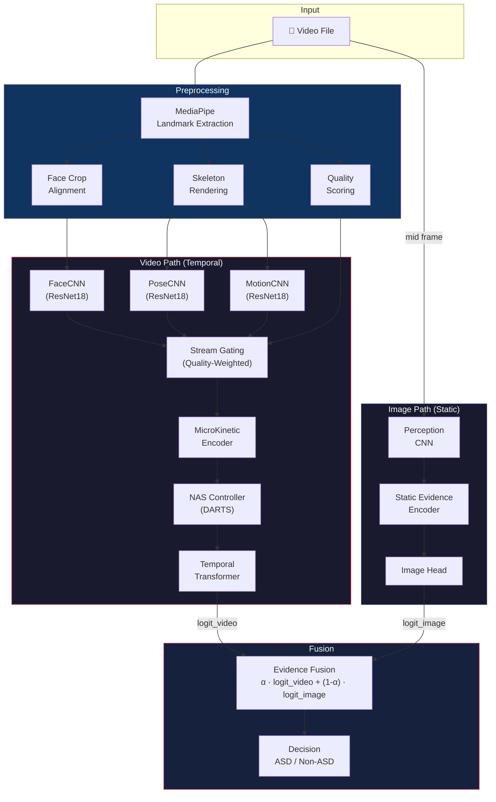

<p align="center">
  <h1 align="center">🧠 ASDMotion</h1>
  <p align="center">
    <strong>AI-Powered Autism Spectrum Disorder Detection from Video</strong>
  </p>
  <p align="center">
    A hybrid CNN + Temporal Transformer pipeline that detects ASD-related behavioral markers from video recordings using landmark kinematics, motion analysis, and neural architecture search.
  </p>
</p>

<p align="center">
  
  
  
  
  
</p>

---

## 📋 Overview

ASDMotion analyzes short video clips of children to classify Autism Spectrum Disorder (ASD) vs. typically developing (TD) peers. It extracts **facial expressions**, **body pose**, and **motion kinematics** from each frame, then processes the temporal sequence through a transformer-based reasoning engine to make a clinical-grade prediction.

### Key Innovations

- **Dual-Path Architecture** — Video path (temporal) + Image path (static) fused via learnable evidence fusion
- **Neural Architecture Search (NAS)** — DARTS-style differentiable search over encoder kernels, transformer heads/layers/ff-dim
- **Quality-Aware Stream Gating** — Dynamically re-weights face/pose/motion streams based on MediaPipe detection confidence
- **MicroKinetic Event Detection** — Learnable 1D temporal convolutions detect behavioral events at multiple time scales
- **Comprehensive Training Augmentation** — Temporal masking, speed perturbation, jitter, Gaussian noise for robust transformer training

---

## 🏗️ Architecture



---

## 🔧 Tech Stack

| Component | Technology | Purpose |
|---|---|---|
| **Deep Learning** | PyTorch ≥ 2.0 | Model training, inference, and NAS |
| **Vision Backbone** | ResNet18 (torchvision) | Face, pose, and motion feature extraction |
| **Landmark Detection** | Google MediaPipe | Face/pose landmark extraction and quality scoring |
| **Architecture Search** | DARTS (Differentiable) | Searches encoder kernels, transformer configs |
| **Training** | AdamW, Cosine Annealing | Optimizer with warmup and weight decay |
| **Evaluation** | scikit-learn | Metrics: AUC, F1, Sensitivity@95Specificity, ECE |
| **Reporting** | Matplotlib, PDF | Auto-generated training reports with loss curves |
| **API** | FastAPI + Uvicorn | REST API for video upload and prediction |
| **Computer Vision** | OpenCV, Pillow | Video I/O, face alignment, skeleton rendering |

---

## 📂 Project Structure

```
ASDMotion/
├── src/
│   ├── models/                        # Neural network modules
│   │   ├── pipeline_model.py          # ASDPipeline — main end-to-end model
│   │   ├── fusion.py                  # EvidenceFusion — learnable α blending
│   │   ├── nas_controller.py          # MicroNASController — DARTS search
│   │   ├── video/
│   │   │   ├── cnn_encoders/          # ResNet18 encoders (face, pose, motion)
│   │   │   ├── microkinetic_encoders/ # Temporal event detection
│   │   │   ├── transformer_reasoning/ # TemporalTransformer
│   │   │   ├── mediapipe_layer/       # Landmark extraction & quality
│   │   │   └── utils/                 # Device config, memory utils
│   │   └── image/
│   │       ├── perception.py          # PerceptionCNN for static frames
│   │       └── static_encoder.py      # Static evidence encoder
│   ├── training/
│   │   ├── train.py                   # Main training loop (5-fold CV + NAS)
│   │   ├── dataset.py                 # VideoDataset with temporal augmentation
│   │   ├── losses.py                  # WeightedBCELoss + NAS entropy reg
│   │   ├── optim.py                   # AdamW with separate param groups
│   │   ├── scheduler.py              # Cosine annealing with linear warmup
│   │   ├── callbacks.py              # EarlyStopping + ModelCheckpoint
│   │   ├── explainability.py         # Attention maps + SHAP importance
│   │   └── report.py                 # PDF report generation
│   ├── pipeline/
│   │   ├── preprocess.py              # Video → frames → landmarks pipeline
│   │   └── inference.py               # Single-video prediction script
│   └── api/
│       └── app.py                     # FastAPI REST endpoint
├── tests/                             # Unit & integration tests
├── data/                              # Video data and CSVs
├── results/                           # Checkpoints and training reports
├── configs/                           # Configuration files
├── deployment/                        # Docker and API deployment
├── requirements.txt
├── setup.py
├── run_train.ps1                      # Windows training launcher
└── README.md
```

---

## 🚀 Getting Started

### Prerequisites

- Python 3.10+
- CUDA-capable GPU (recommended) or CPU
- Windows 10/11 or Linux

### Installation

```bash
# Clone the repository
https://github.com/neuro-paradigm/ASDM
cd ASDM

# Create virtual environment
python -m venv venv

# Activate (Windows)
.\venv\Scripts\activate
# Activate (Linux/Mac)
source venv/bin/activate

# Install dependencies
pip install -r requirements.txt
pip install -e .
```

**Or use the automated setup script (Windows):**

```powershell
.\setup_windows.ps1
```

### Prepare Data

Create a CSV file (`data/videos.csv`) with the following format:

```csv
video_path,label
C:/data/videos/child_01.mp4,1
C:/data/videos/child_02.mp4,0
```

> **Labels**: `1` = ASD, `0` = Non-ASD (Typically Developing)

---

## 🏋️ Training

### Full Training Pipeline

```bash
python src/training/train.py --csv data/videos.csv --epochs 15
```

### Training Arguments

| Argument | Default | Description |
|---|---|---|
| `--csv` | *(required)* | Path to CSV with `video_path, label` columns |
| `--epochs` | `15` | Training epochs per fold |
| `--final_epochs` | `10` | Epochs for final model on full dataset |
| `--batch_size` | `4` | Batch size |
| `--lr` | `1e-4` | Model learning rate |
| `--arch_lr` | `3e-4` | NAS architecture learning rate |
| `--fusion_lr` | `1e-3` | Fusion module learning rate |
| `--clip_grad` | `0.5` | Gradient clipping max norm |
| `--dropout` | `0.5` | Dropout rate |
| `--freeze_alpha_epochs` | `3` | Epochs to freeze fusion alpha |
| `--warmup` | `3` | LR warmup epochs |
| `--nas_epochs` | `5` | NAS discovery phase epochs |
| `--patience` | `7` | Early stopping patience |

### What Happens During Training


1. **NAS Discovery** — Genetic search over encoder kernel sizes, transformer heads/layers/FF dimensions
2. **Stratified 5-Fold Cross Validation** — Each fold trains with the discovered architecture, monitors AUC for checkpointing
3. **Final Model Training** — Best architecture trained on 85% of data with 15% held out for validation
4. **Temperature Calibration** — Learns optimal temperature scalar for probability calibration
5. **Report Generation** — PDF reports with loss curves, attention heatmaps, SHAP feature importance

### Training Outputs

```
results/
├── asd_best_fold1.pth          # Best model for each fold
├── asd_best_fold2.pth
├── ...
├── asd_pipeline_model.pth      # Final production model
├── fold_1_report.pdf           # Per-fold training reports
└── final_report.pdf            # Final model report
```

---

## 🔍 Inference

### Command Line

```bash
python src/pipeline/inference.py --video path/to/video.mp4 --model results/asd_pipeline_model.pth
```

### REST API

```bash
# Start the API server
python src/api/app.py

# Send a prediction request
curl -X POST "http://localhost:8000/predict" \
  -F "file=@path/to/video.mp4"
```

**Response:**
```json
{
  "filename": "video.mp4",
  "prediction": "ASD",
  "asd_probability": 0.8234,
  "device": "cuda"
}
```

---

## 🧪 Testing

```bash
# Run all tests
python -m pytest tests/ -v

# Run specific test modules
python -m pytest tests/test_pipeline.py -v        # Pipeline model tests
python -m pytest tests/test_nas.py -v              # NAS controller tests
python -m pytest tests/test_transformer.py -v      # Transformer tests
python -m pytest tests/test_metric_sanity.py -v    # Metric computation tests
```

---

## 🧩 Key Components

### Evidence Fusion

The dual-path architecture fuses temporal (video) and static (image) evidence using a **learnable alpha weight** in logit space:

```
logit_final = α · logit_video + (1 - α) · logit_image
```

Alpha is parameterised via sigmoid-constrained `log_alpha` and is **frozen for the first 3 epochs** to let the encoder/transformer stabilise before the fusion weight is tuned.

### Neural Architecture Search (NAS)

DARTS-style differentiable search over:
- **Encoder**: Kernel sizes `[3, 5, 7, 11]`, channel widths `[64, 128, 256]`, pooling `[avg, max, attention]`
- **Transformer**: Heads `[4, 8]`, layers `[2, 3, 4]`, FF dimensions `[512, 1024, 2048]`, d_model `[64, 128]`

Temperature annealing (Gumbel-Softmax) drives architecture selection from exploration to exploitation during training.

### Data Augmentation Strategy

Augmentations are organised into three categories optimised for transformer training:

| Category | Augmentations | Key Property |
|---|---|---|
| **Spatial** | Flip, rotation, color jitter, affine, random erasing | Same params across all frames |
| **Temporal** | Frame masking, temporal jitter, speed perturbation | Teaches attention over missing data |
| **Feature** | Gaussian noise, quality score noise | Regularises CNN features and quality inputs |

---

## 📊 Evaluation Metrics

The training pipeline automatically reports:

- **AUC** (primary metric for checkpointing and early stopping)
- **F1 Score** at optimal threshold (via precision-recall curve)
- **Sensitivity @ 95% Specificity** (clinically relevant)
- **Expected Calibration Error (ECE)**
- **Accuracy** at both fixed 0.5 and optimal thresholds

---

## 📄 License

This project is intended for **research and educational purposes**. Please consult appropriate medical professionals for clinical ASD assessments.
